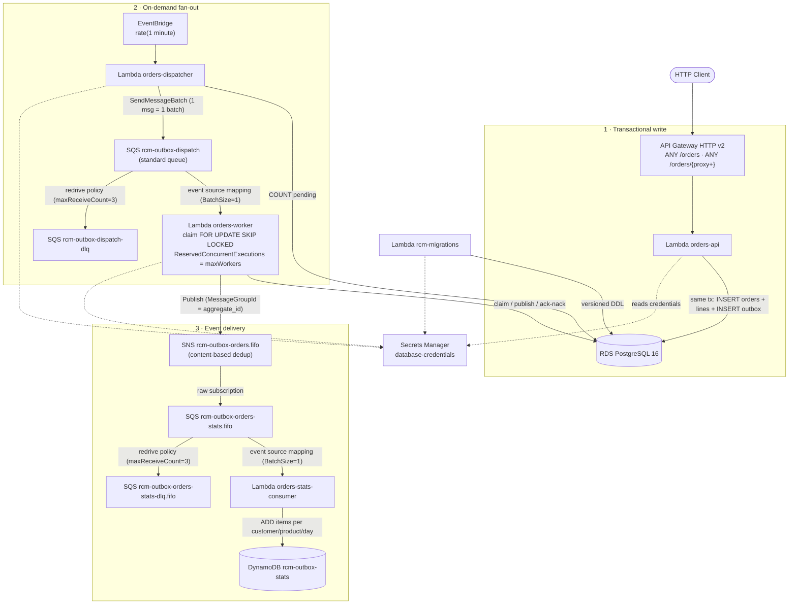

# rcm-outbox

Reference implementation of the **transactional outbox pattern** on a **serverless architecture over AWS** (Lambda + Pulumi), written in Go.

The problem it solves: when a service writes to its database and then publishes an event (e.g. to SNS), it can fail between both operations (the *dual-write problem*). The solution is to write the event to an `outbox` table **within the same transaction** as the business data, and publish it afterwards asynchronously and reliably.

> Spanish documentation: [README.md](README.md)

## Topology



### Event flow

1. `orders-api` receives the request and, in **a single transaction**, inserts the order (and its lines) and the event into the `outbox` table.
2. Every minute, EventBridge invokes the **dispatcher**, which counts pending records and enqueues one work message per required batch (bounded by `maxWorkers`).
3. Each message triggers a **worker** that claims a block with `FOR UPDATE SKIP LOCKED`, publishes it to SNS outside of any transaction, and acks/nacks: success → `published`; failure → retry with exponential backoff + jitter, or `dead` (logical DLQ in the table) once attempts are exhausted.
4. The SNS FIFO topic delivers to consumer queues (raw message delivery, ordering by `aggregate_id`).

Full worker/dispatcher details in [docs/en/outbox-worker.md](docs/en/outbox-worker.md).

## Modules

| Module | Type | Description |
|---|---|---|
| [`orders-api`](orders-api/) | Lambda | Orders CRUD API (API Gateway HTTP v2, payload 2.0). Writes the outbox event in the same tx. |
| [`orders-dispatcher`](orders-dispatcher/) | Lambda | Counts pending records and enqueues publishing jobs into SQS. |
| [`orders-workers`](orders-workers/) | Lambda | Claims outbox batches and publishes them to SNS with retries/backoff. |
| [`orders-stats-consumer`](orders-stats-consumer/) | Lambda | Consumer of the events delivered via SNS→SQS: aggregates purchased items per customer, product and day into DynamoDB. |
| [`rcm-migrations`](rcm-migrations/) | Lambda | Applies embedded SQL migrations (advisory lock + `schema_migrations` table). Invoked manually. |
| [`rcm-platform`](rcm-platform/) | Library | Shared code: `logger`, `config`, `secrets`, `database` (pgx pool). |
| [`infra`](infra/) | IaC | Pulumi in Go: generic components (`internal/platform`) and per-domain composition (`internal/domains`). |

Monorepo managed with a [Go workspace](go.work); each module is independent (`github.com/rcastellor/rcm-outbox/<module>`).

## Requirements

- Go 1.25+
- Docker (floci, the local AWS emulator)
- [Pulumi CLI](https://www.pulumi.com/docs/iac/get-started/install/) and AWS CLI v2
- `bc` (only for the load test)

## Quickstart (local environment with floci)

```bash
make up           # starts floci + UI (http://localhost:4566 / http://localhost:4500)
make build        # compiles the Lambdas to bin/<module>/bootstrap
make infra-init   # initializes the Pulumi dev stack (first time only)
make infra-up     # deploys all the infrastructure
make migrate      # applies pending migrations via the rcm-migrations Lambda
```

The Makefile exports `AWS_ENDPOINT_URL` and fake credentials so that everything (Pulumi, AWS CLI, tests) talks to floci instead of real AWS.

### Trying the full flow

```bash
# Create an order (adjust the API id if it changes)
curl -s -X POST http://localhost:4566/restapis/<api-id>/dev/_user_request_/orders \
  -H 'Content-Type: application/json' \
  -d '{"customerId":"c1","status":"created","lines":[{"productId":"p1","quantity":2,"unitPrice":10.5}]}'

# Load test: 10,000 orders with 10 threads
test/load-test.sh
```

In under a minute the dispatcher will enqueue jobs, the workers will publish the events to SNS and the stats consumer will aggregate them into the DynamoDB table `rcm-outbox-stats`. Check it with `make test-e2e`.

## Commands

| Command | Description |
|---|---|
| `make help` | Help with all targets |
| `make up` / `down` / `logs` / `ps` | floci lifecycle (Docker Compose) |
| `make build` | Compiles all Lambdas (`GOOS=linux GOARCH=amd64 CGO_ENABLED=0`) |
| `make test` | Unit tests for all modules |
| `make lint` | `go vet` across all modules |
| `make test-e2e` | E2E test against floci (requires `up` + `build` + `infra-up` + `migrate`) |
| `make migrate` | Invokes the `rcm-migrations` Lambda |
| `make redrive QUEUE=<queue>` | Re-enqueues messages from a DLQ back to its source queue |
| `make infra-init` | Initializes the Pulumi `dev` stack (local backend + `stack init`, first time only) |
| `make infra-preview` / `infra-refresh` / `infra-up` / `infra-destroy` | Pulumi lifecycle (`dev` stack) |
| `make clean` | Removes `bin/` |

> ⚠️ Do not run `go test ./...` from the repo root: there is no root package (workspace mode fails). Use the Makefile targets or cd into each module.

## Configuration

The stack configuration lives in [`infra/Pulumi.dev.yaml`](infra/Pulumi.dev.yaml):

- `database`: RDS options (e.g. `skipFinalSnapshot`).
- `topics`: SNS topics to create (`name`, `fifo`).
- `worker`: `topicName`, `batchSize`, `maxWorkers`, `maxAttempts`, `backoffBaseSeconds`, `maxBackoffSeconds`.

Conventions in [docs/en/config-conventions.md](docs/en/config-conventions.md); migration conventions in [docs/en/migrations-conventions.md](docs/en/migrations-conventions.md); API design in [docs/en/orders-api.md](docs/en/orders-api.md).

## Status and roadmap

- ✅ Complete producer: transactional write, on-demand dispatcher, worker with atomic claim, backoff/jitter and logical DLQ in the table.
- ✅ Stats consumer (`orders-stats-consumer`): `orders-stats` queue, DynamoDB table and e2e test (`make test-e2e`).
- ✅ SQS DLQs with redrive policy (`maxReceiveCount=3`) and re-processing via `make redrive QUEUE=<queue>`.
- 🚧 CloudWatch alarms, log retention and tracing.
- 🚧 Hardening: TLS on the DSN, pool sizing, idempotency on POST /orders.
