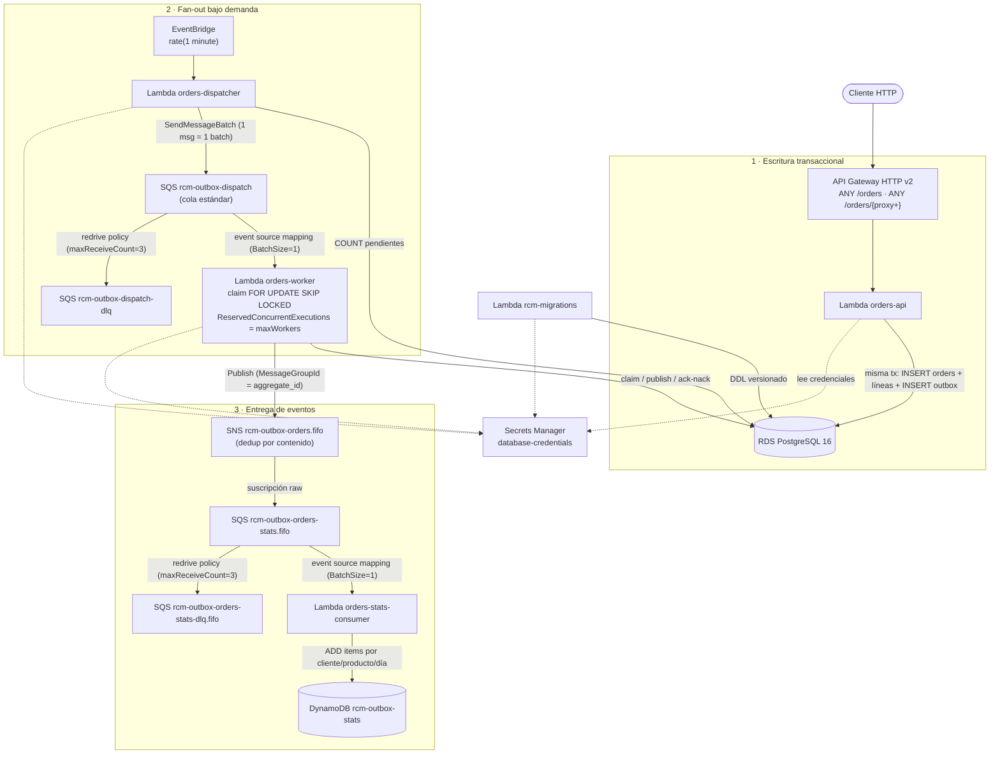

# rcm-outbox

Implementación de referencia del **patrón transactional outbox** en una arquitectura **serverless sobre AWS** (Lambda + Pulumi), escrita en Go.

El problema que resuelve: cuando un servicio escribe en su base de datos y después publica un evento (p. ej. en SNS), puede fallar entre ambas operaciones (*dual-write problem*). La solución es escribir el evento en una tabla `outbox` **dentro de la misma transacción** que los datos de negocio, y publicarlo después de forma asíncrona y fiable.

## Topología



### Flujo del evento

1. `orders-api` recibe el request y, en **una única transacción**, inserta la orden (y sus líneas) y el evento en la tabla `outbox`.
2. Cada minuto, EventBridge invoca al **dispatcher**, que cuenta los registros pendientes y encola un mensaje de trabajo por cada batch necesario (acotado por `maxWorkers`).
3. Cada mensaje dispara un **worker** que reclama un bloque con `FOR UPDATE SKIP LOCKED`, lo publica en SNS fuera de transacción y hace *ack/nack*: éxito → `published`; fallo → reintento con backoff exponencial + jitter, o `dead` (DLQ lógica en la tabla) al agotar intentos.
4. El topic SNS FIFO entrega a las colas de los consumidores (raw message delivery, orden por `aggregate_id`).

Detalles completos del worker/dispatcher en [docs/outbox-worker.md](docs/outbox-worker.md).

## Módulos

| Módulo | Tipo | Descripción |
|---|---|---|
| [`orders-api`](orders-api/) | Lambda | API CRUD de órdenes (API Gateway HTTP v2, payload 2.0). Escribe el evento outbox en la misma tx. |
| [`orders-dispatcher`](orders-dispatcher/) | Lambda | Cuenta pendientes y encola trabajos de publicación en SQS. |
| [`orders-workers`](orders-workers/) | Lambda | Reclama batches del outbox y publica en SNS con reintentos/backoff. |
| [`orders-stats-consumer`](orders-stats-consumer/) | Lambda | Consumidor de los eventos entregados por SNS→SQS: agrega items comprados por cliente, producto y día en DynamoDB. |
| [`rcm-migrations`](rcm-migrations/) | Lambda | Aplica migraciones SQL embebidas (advisory lock + tabla `schema_migrations`). Se invoca manualmente. |
| [`rcm-platform`](rcm-platform/) | Librería | Código compartido: `logger`, `config`, `secrets`, `database` (pool pgx). |
| [`infra`](infra/) | IaC | Pulumi en Go: componentes genéricos (`internal/platform`) y composición por dominio (`internal/domains`). |

Monorepo gestionado con [Go workspace](go.work); cada módulo es independiente (`github.com/rcastellor/rcm-outbox/<módulo>`).

## Requisitos

- Go 1.25+
- Docker (floci, el emulador AWS local)
- [Pulumi CLI](https://www.pulumi.com/docs/iac/get-started/install/) y AWS CLI v2
- `bc` (solo para el load test)

## Quickstart (entorno local con floci)

```bash
make up           # arranca floci + UI (http://localhost:4566 / http://localhost:4500)
make build        # compila las Lambdas a bin/<módulo>/bootstrap
make infra-init   # inicializa el stack dev de Pulumi (solo la primera vez)
make infra-up     # despliega toda la infraestructura
make migrate      # aplica las migraciones pendientes vía la Lambda rcm-migrations
```

El Makefile exporta `AWS_ENDPOINT_URL` y credenciales falsas para que todo (Pulumi, AWS CLI, tests) hable con floci y no con AWS real.

### Probar el flujo completo

```bash
# Crear una orden (ajusta el ID del API si cambia)
curl -s -X POST http://localhost:4566/restapis/<api-id>/dev/_user_request_/orders \
  -H 'Content-Type: application/json' \
  -d '{"customerId":"c1","status":"created","lines":[{"productId":"p1","quantity":2,"unitPrice":10.5}]}'

# Load test: 10.000 órdenes con 10 hilos
test/load-test.sh
```

En menos de un minuto el dispatcher encolará trabajos, los workers publicarán los eventos en SNS y el consumidor de estadísticas los agregará en la tabla DynamoDB `rcm-outbox-stats`. Compruébalo con `make test-e2e`.

## Comandos

| Comando | Descripción |
|---|---|
| `make help` | Ayuda con todos los targets |
| `make up` / `down` / `logs` / `ps` | Ciclo de vida de floci (Docker Compose) |
| `make build` | Compila todas las Lambdas (`GOOS=linux GOARCH=amd64 CGO_ENABLED=0`) |
| `make test` | Tests unitarios de todos los módulos |
| `make lint` | `go vet` sobre todos los módulos |
| `make test-e2e` | Test e2e contra floci (requiere `up` + `build` + `infra-up` + `migrate`) |
| `make migrate` | Invoca la Lambda `rcm-migrations` |
| `make redrive QUEUE=<cola>` | Reencola los mensajes de una DLQ en su cola origen |
| `make infra-init` | Inicializa el stack `dev` de Pulumi (backend local + `stack init`, solo la primera vez) |
| `make infra-preview` / `infra-refresh` / `infra-up` / `infra-destroy` | Ciclo de vida de Pulumi (stack `dev`) |
| `make clean` | Borra `bin/` |

> ⚠️ No ejecutes `go test ./...` desde la raíz: no hay paquete raíz (workspace mode falla). Usa los targets del Makefile o entra en cada módulo.

## Configuración

La configuración del stack vive en [`infra/Pulumi.dev.yaml`](infra/Pulumi.dev.yaml):

- `database`: opciones de RDS (p. ej. `skipFinalSnapshot`).
- `topics`: topics SNS a crear (`name`, `fifo`).
- `worker`: `topicName`, `batchSize`, `maxWorkers`, `maxAttempts`, `backoffBaseSeconds`, `maxBackoffSeconds`.

Convenciones en [docs/config-conventions.md](docs/config-conventions.md); convenciones de migraciones en [docs/migrations-conventions.md](docs/migrations-conventions.md); diseño de la API en [docs/orders-api.md](docs/orders-api.md).

## Estado y roadmap

- ✅ Productor completo: escritura transaccional, dispatcher bajo demanda, worker con claim atómico, backoff/jitter y DLQ lógica en tabla.
- ✅ Consumidor de estadísticas (`orders-stats-consumer`): cola `orders-stats`, tabla DynamoDB y test e2e (`make test-e2e`).
- ✅ DLQs de SQS con redrive policy (`maxReceiveCount=3`) y re-procesado con `make redrive QUEUE=<cola>`.
- 🚧 Alarmas CloudWatch, log retention y tracing.
- 🚧 Endurecimiento: TLS en el DSN, pool sizing, idempotencia en POST /orders.
